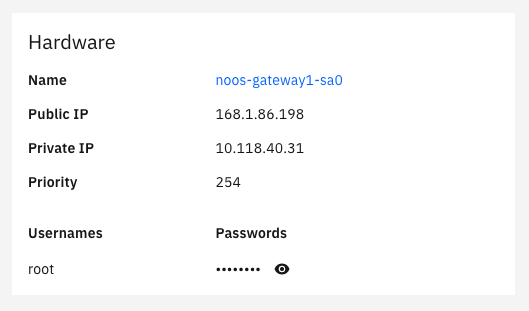
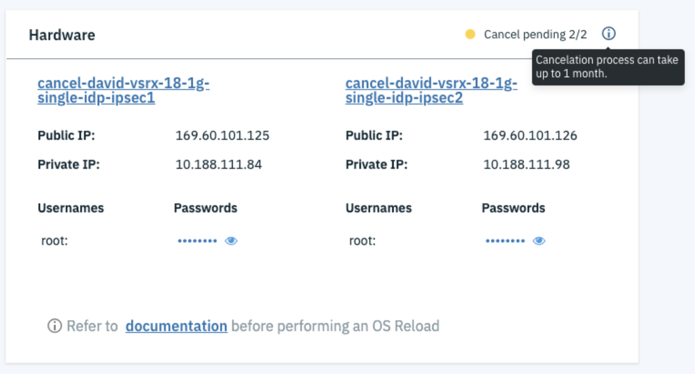

---

copyright:
  years: 2017, 2020
lastupdated: "2020-08-13"

keywords: cancel, appliances

subcollection: gateway-appliance

---

{:shortdesc: .shortdesc}
{:new_window: target="_blank_"}
{:codeblock: .codeblock}
{:pre: .pre}
{:screen: .screen}
{:tip: .tip}
{:download: .download}
{:note: .note}
{:important: .important}
{:help: data-hd-content-type='help'}
{:support: data-reuse='support'}

# Canceling a gateway appliance
{: #cancel-gateway-appliance}
{: help}
{: support}

You can cancel your gateway appliance at any time by following these instructions.
{: shortdesc}

1. From your browser, open the [IBM Cloud catalog ](https://cloud.ibm.com){: new_window} and log in to your account.
2. Select the Menu icon  from the top left, then click **Classic Infrastructure**.
3. Choose **Network > Gateway Appliances**.
4. Click the Gateway Appliance name to open the Gateway Appliance Details page.
5. From the Hardware section, click the name of the hardware member to open the server details page.

   

5. Select **Actions > Cancel device** and follow the prompts to cancel the gateway appliance.

For Highly Available server pairs, you must select and cancel both server members listed in the Hardware section on the Gateway Appliance Details page to cancel the gateway.
{: note}

After you cancel the gateway appliance, the server(s) are reclaimed at the next billing cycle. For example, if you cancel the server(s) on September 8, the service is available until it is reclaimed on October 1.

You can verify if your gateway appliance is in the process of being canceled by viewing the Gateway Appliance Details page. Gateways in the process of being canceled show as **Cancel pending**.

   

If necessary, you can expedite the process by opening a case with IBM Support and requesting that the gateway appliance be reclaimed immediately. This process can take 24 to 48 hours.
{: tip}
