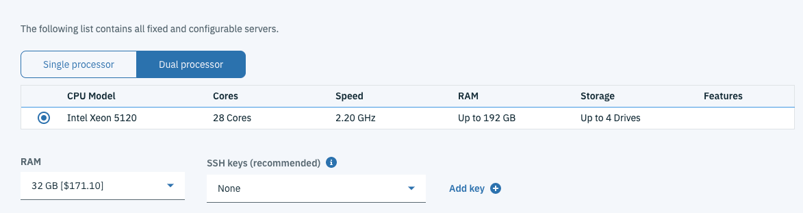
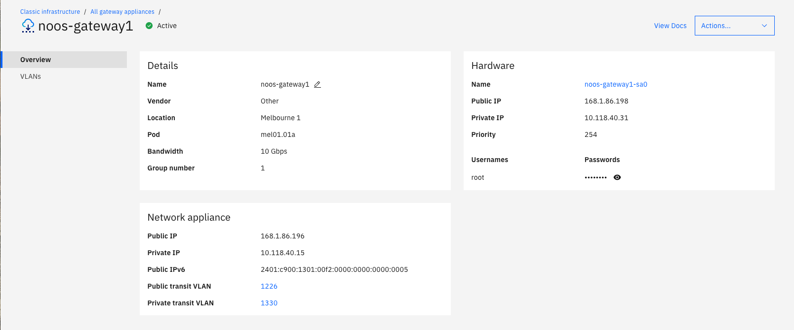
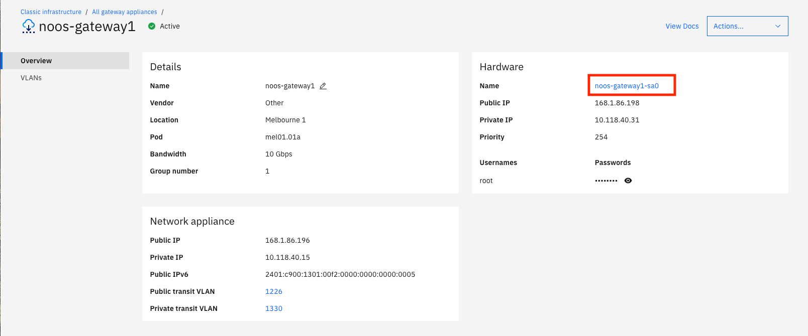
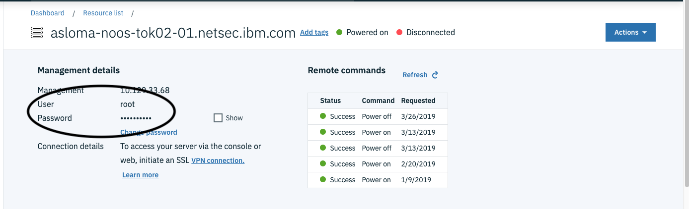
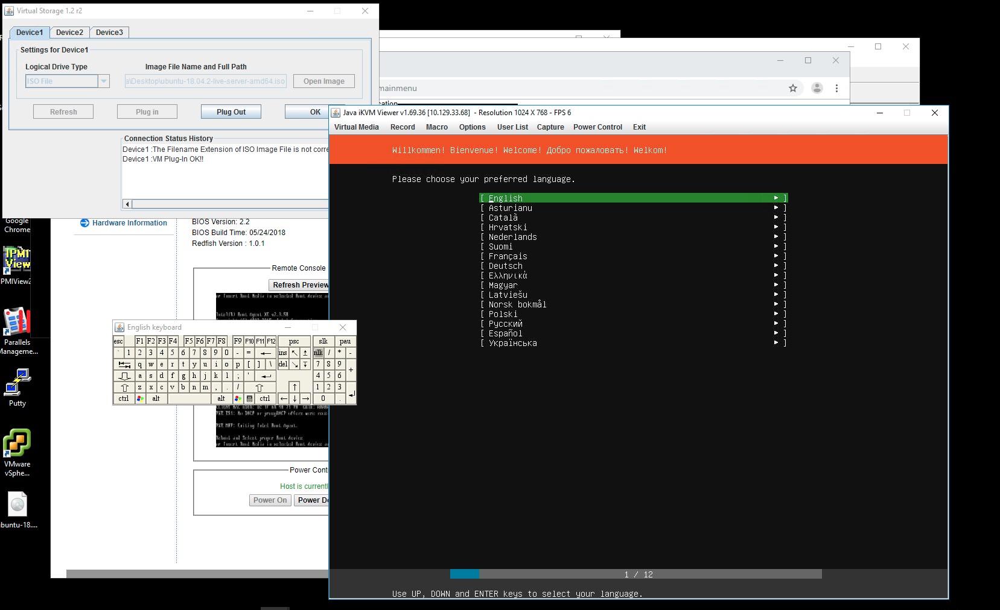

---

copyright:
  years: 2018
lastupdated: "2019-11-13"

keywords: order, gateway, appliance, virtual router appliance, vra

subcollection: gateway-appliance

---

{:shortdesc: .shortdesc}
{:new_window: target="_blank_"}
{:codeblock: .codeblock}
{:pre: .pre}
{:screen: .screen}
{:tip: .tip}
{:download: .download}
{:note: .note}
{:important: .important}

# Ordering a Bring Your Own Gateway Appliance
{: #order-byoa}

 {{site.data.keyword.cloud}} Gateway 1G and 10G offerings include the Virtual Router Appliance and Juniper vSRX. You can also deploy a third Gateway solution with no operating system installed. This solution provides the same 1G and 10G hardware, as well as the same networking, but provides you the flexibility to install a custom operating system and Gateway software stack (such as F5 or Palo Alto).
 {: shortdesc}

You can use the information in this topic to order a Gateway Appliance with the Bring Your Own Appliance (BYOA) option.

You will need the software license(s) and images for your chosen operating system and Gateway software solution.
{: note}

## Ordering with a linked account

To order a Gateway Appliance with the Bring Your Own Appliance (BYOA) option, perform the following procedure:

1. From your browser, open the [IBM Cloud console ](https://cloud.ibm.com){:new_window} and log into your account.

2. Select the Menu icon  from the top left, then click **Classic Infrastructure**.

3. Choose **Network > Gateway Appliances**.

4. Choose **Other** from the **Gateway Vendor** section.

  If you do not see the **Other** option, contact IBM Support for details on enabling it for your account.
  {: note}

  

5. Enter your Hostname and Domain Name information in the **Gateway Appliance** section. Ensure the default information that populates the fields is accurate, and correct it if it is not.

6. Select your desired data center location and the specific Pod you want from the dropdown menu.

  Only pods that already have an associated VLAN display. If you want to provision your Gateway Appliance in a pod that isn't listed, you must create a VLAN in that pod.
  {: note}

  The High Availability option is selected by default.
  {: note}

7. From the **Configuration** section, choose your processor. Single processors are 1G and dual processors are 10G.

  

8. Select your RAM settings.

9. Select your SSH keys, if you want to use them to authenticate access to your new Gateway.

8. From the **Storage Disks** section, choose the options that meet your storage requirements.

9. From the **Network Interface** section, select your uplink port speeds. The default selection is a single interface, but there are redundant and private options as well. Choose the one that best fits your needs.

  The **Network Interface Add Ons** section allows you to select an IPv6 address if required, and shows you any additional included default options.
  {: note}

10. Review your selections, check that you have read the Third Party Service Agreements, then click **Create**. The form verifies the order automatically.

After your order is approved, the provisioning of your IBM Cloud Gateway starts automatically. When the provisioning process completes, the new Gateway appears in the Gateway Appliances list page. Click the Gateway name to open the Gateway Details page. You will find the IP addresses, login username, and password for the device.

  

## Installing an operating system on the gateway

To install an operating system on the Gateway, perform the following procedure:

This procedure uses the IPMI interface to mount and boot to an OS image. Make sure you have the ISO image of the operating system you want to install, as well as the Gateway software image, and any required licenses.
{: important}

1. [Access the Gateway Appliances screen](/docs/gateway-appliance?topic=gateway-appliance-viewing-all-gateway-appliances#viewing-all-gateway-appliances) in the IBM Cloud console.

2. Click the Gateway Appliance name for BYOG appliance to access the Gateway Appliance Details screen.

  

2. Click the **Remote Management** tab on the left side of the screen, then make note of the IPMI private IP address and root credentials listed in the **Management Details** section.

  

3. Mount and boot your operating system image, then install it using one of the methods explained [here](/docs/bare-metal?topic=bare-metal-bm-mount-iso).

  You will use the IPMI private IP address and root credentials from step two here.
  {: note}

  The server should, by default, boot to the mounted image without the need for a password. Ensure no other media is mounted to the server before proceeding with this step.
  {: important}

  Additional documentation on setting up a VPN connection can be found [here](/docs/iaas-vpn?topic=VPN-standalone-vpn-clients).
  {: tip}

Below is an example of an Ubuntu 18.04 ISO image that has been mounted to the Bring Your Own Appliance's IPMI web interface using the Java iKVM Viewer and Virtual Storage feature.

  
