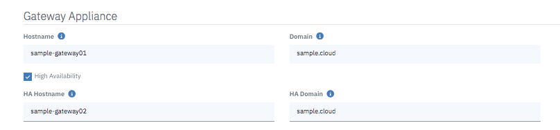
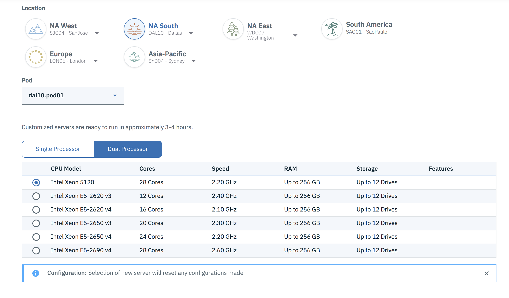
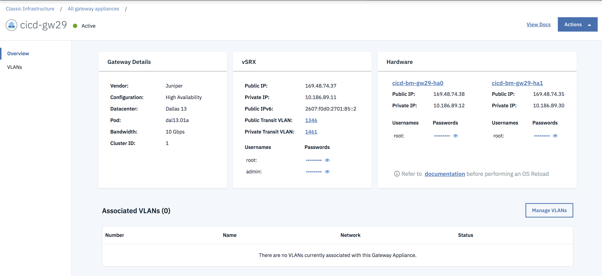

---

copyright:
  years: 2018
lastupdated: "2019-09-25"

keywords: order, gateway, appliance, vsrx, juniper

subcollection: gateway-appliance

---

{:shortdesc: .shortdesc}
{:new_window: target="_blank"}
{:codeblock: .codeblock}
{:pre: .pre}
{:screen: .screen}
{:tip: .tip}
{:download: .download}
{:note: .note}
{:important: .important}

# Ordering an IBM Cloud Juniper vSRX
{: #order-vsrx}

You can order your Gateway Appliance, using one of these methods:

## Ordering with a linked account
{: #ordering-with-a-linked-account}

If your account is linked, follow this procedure:

1. From your browser, open the [IBM Cloud console ](https://cloud.ibm.com){:new_window} and log into your account.

2. Select the Menu icon  from the top left, then click **Classic Infrastructure**.

3. Choose **Network > Gateway Appliances**.

4. Choose **Juniper vSRX (up to 1 Gbps)** or **Juniper vSRX (up to 10 Gbps)** under **Gateway Vendor**.

5. From the **Gateway appliance** section, enter your **Hostname** and **Domain** name information. These fields will already be populated with default information, so ensure the values are correct.

	

6. Check the **High Availability** option if desired, then select your desired data center **Location**, and the specific **Pod** you want from the dropdown menu.

  Only pods that already have an associated VLAN will display here. If you wish to provision your Gateway Appliance in a pod you don't see listed, first create a VLAN there.
  {: note}

	

7. From the **Configuration** section, choose your processor's RAM. You can also define an SSH key, if you want to use it to authenticate access to your new Gateway.

  The appropriate processor is chosen for you based on the license version you selected in step two. You can choose different RAM configurations, however.
  {: note}

8. From the **Storage disks** section, choose the options that meet your storage requirements.

  RAID0 and RAID1 options are available for added protection against data loss, as are hot spares (backup components that can be placed into service immediately when a primary component fails).
  {: note}

  You may have up to four disks per vSRX. "Disk size" with a RAID configuration is the usable disk size, as RAID configurations are mirrored.
  {: note}

  Reserve more than the default disk setting if you plan to run network diagnostics that generate detailed logs.
  {: tip}

9. From the **Network interface** section, select your **Uplink port speeds**. The default selection is a single interface, but there are redundant and private only options as well. Choose the one that best fits your needs.

  The Network Interface **Add Ons** section allows you to select an IPv6 address if required, and shows you any additional included default options.

10. Review your selections, check that you have read the Third Party Service Agreements, then click **Create**. The order is verified automatically.

After your order is approved, the provisioning of your {{site.data.keyword.vsrx_full}} Gateway starts automatically. When the provisioning process is complete, the new vSRX will appear in the Gateway Appliances list page. Click the gateway name to open the Gateway Details page. You will find the IP addresses, login username, and password for the device.

Remember that once you order and configure your gateway from the IBM Cloud Catalog, you must also configure the device itself with the same settings.
{: tip}

## Ordering with an unlinked account
{: #ordering-with-a-unlinked-account}

If your account is unlinked, follow this procedure:

1.	Open the [Customer Portal ](https://control.softlayer.com/){: new_window} and log into your account.
2.	In the Customer Portal navigation, select **Network > Gateway Appliances**.
3.	From the **Gateway Appliances** list, click **Order Gateway**.
4.	From the **Order** page, select your desired data center from the dropdown menu, then choose the desired type of server hardware on which the Juniper vSRX will be provisioned.

	If you plan to use a Dual Processor Multi-Core Server, you must select **Intel Xeon 5120** as the server type.
  {: note}

5.	On the **Order** page, select the **High Availability Pair** option if desired, then select the **Memory** size.
6. 	Next, click the **Juniper** tab under **Operating System**, select **Juniper vSRX (up to 1 Gbps) Standard** for a single processor server, or **Juniper vSRX (up to 10 Gbps) Standard** for a dual processor server.
7. 	Finally, select the desired network uplink speed.
8.	Review your selections, then click **Add to Order**. Your order will be verified automatically.
9.	On the **Checkout** page, if you already own VLANs in the selected data center, select the back-end VLANs that you want to protect. Be sure to:
	* Give a hostname and domain name for your server.
	* Select an SSH key for access authentication, if desired.
	* Check all boxes for the IBM Cloud service terms and Third-party Software Terms.
10. Click **Submit Order**.

## What's next?
{: #what-s-next-}

After your order is approved, the provisioning of your vSRX starts automatically. When the provisioning process is complete, the gateway will appear in the **Gateway Appliances** list.

Click the gateway name to open the **Gateway Details** page. You'll find the IP addresses, login username, and passwords for the device.

